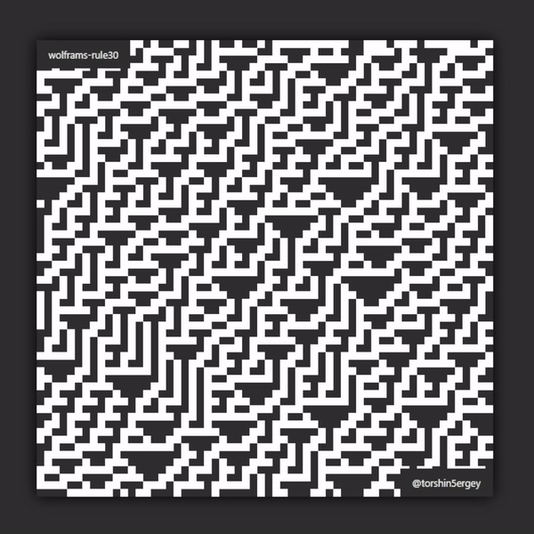
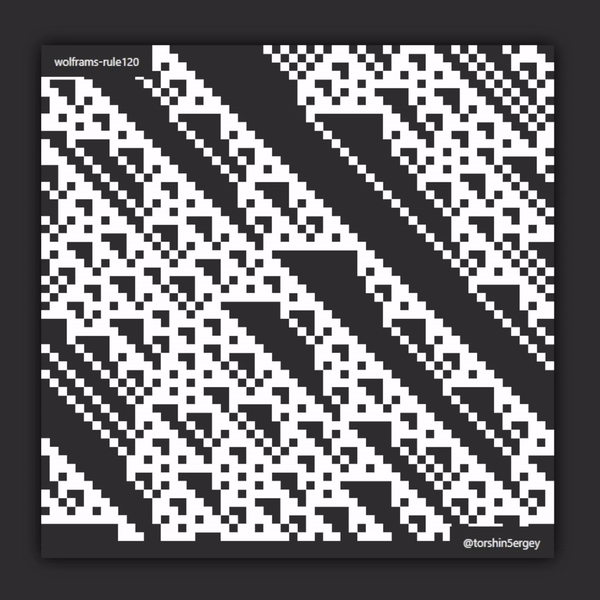

# Wolfram's Rules with p5.js

Cellular automaton Wolfram's in JavaScript using p5.js.





## Description
This project implements cellular automatons:
- [Rule 184](https://en.wikipedia.org/wiki/Rule_184)
- [Rules 30, 120, 135, 225](https://en.wikipedia.org/wiki/Rule_30)

## Rules


## How to Run

1. Clone this repository to your local machine.
```bash
git clone https://github.com/torshin5ergey/creative-code-playground.git
```
2. Go to `wolframs-rules` directory.
```bash
cd creative-code-playground/cellular-automata/wolframs-rules
```
3. Open the `index.html` file in your web browser. The default is `rules30-120-135-225-infinite-loop.js` sketch with "Rule 30" animation.
    - To see other animations you need to change sketch

## View Online

You can also view this project online in p5js Web Editor:
- [Rule 184](https://editor.p5js.org/torshin5ergey/full/CHG4PIw2g)
- [Rule 30, 120, 135, 225](https://editor.p5js.org/torshin5ergey/full/CHG4PIw2g)

## How to Use in Your Project

1. Clone the repository to your computer.
2. Include `p5.js` in your project.
3. Import `cellular-automata/wolframs-rules/sketch_name.js` into your project and use it in your code.
4. Customize.
    - If needed, you may need to adjust the following lines in the `sketch_name.js` file to fit your desired canvas size or    container element:
        ```javascript
        let canvas = createCanvas(windowWidth * 0.9, windowHeight * 0.9);
        canvas.parent("canvas");
        ```
    - You can modify the dimensions passed to `createCanvas()` to adjust the size of the canvas. Additionally, you may need to change the parent element ID passed to `canvas.parent()`. Alternatively, you can use the following line and comment out the two lines above to use a fixed canvas size:
        ```javascript
        createCanvas(CANVAS_W, CANVAS_H);
        ```
        Change `CANVAS_W` and `CANVAS_H` with the desired width and height of the canvas.

## License

Shield: [![CC BY-NC-SA 4.0][cc-by-nc-sa-shield]][cc-by-nc-sa]

This work is licensed under a
[Creative Commons Attribution-NonCommercial-ShareAlike 4.0 International License][cc-by-nc-sa].

[![CC BY-NC-SA 4.0][cc-by-nc-sa-image]][cc-by-nc-sa]

[cc-by-nc-sa]: http://creativecommons.org/licenses/by-nc-sa/4.0/
[cc-by-nc-sa-image]: https://licensebuttons.net/l/by-nc-sa/4.0/88x31.png
[cc-by-nc-sa-shield]: https://img.shields.io/badge/License-CC%20BY--NC--SA%204.0-lightgrey.svg

## Author

Sergey Torshin [@torshin5ergey](https://github.com/torshin5ergey)
